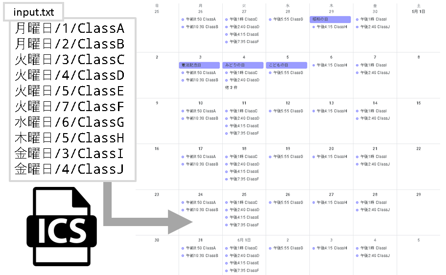

# ICS Formatter Scripts

## Overview

This scirpt can export simple `ics` file by inputting schedules which will be repeated every week.



## Usage

1. put `input.txt` on current directory.

2. run below

```bash
python main.py
```

3. export `output.ics`

## Input Format

```cpp
[開講曜日::string(*曜日)]/[時限::int]/[講義名::string]
```

also [時限] corresponds to the following table.

|時限|時間(UTC+9)|
|:---:|:---:|
|1|08:50~10:20|
|2|10:30~12:00|
|3|13:00~14:30|
|4|14:40~16:10|
|5|16:15~17:45|
|6|17:55~19:25|
|7|19:35~22:05|

This setting can be changed by editting `timeschedule_dictionary` in script.

## Output Format

Defalt setting is

```python
RRULE:FREQ=WEEKLY;BYDAY={weekday_integer};COUNT=16\n
```

It means "The class opened on `weekday` is repeated `COUNT` times".

If you need to change, you will edit this code.

Following references may help you at that time.

- [icsファイルの構造・構文](https://hacknote.jp/archives/23977/)

- [CalDAV(iCalendar)の
rrule（繰り返し設定）一覧まとめ](http://alpyaca-creates.lv9.org/caldavicalendar%E3%81%AErrule%EF%BC%88%E7%B9%B0%E3%82%8A%E8%BF%94%E3%81%97%E8%A8%AD%E5%AE%9A%EF%BC%89%E4%B8%80%E8%A6%A7%E3%81%BE%E3%81%A8%E3%82%81/?i=1)

